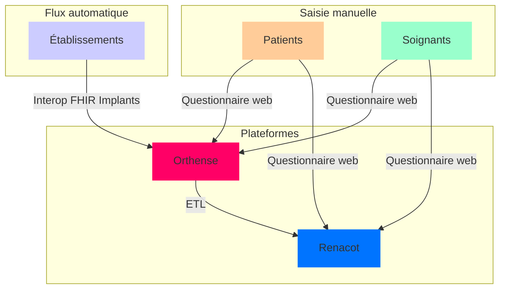

### Introduction
Le registre national des implants en orthopédie est un outil essentiel pour garantir la traçabilité des dispositifs médicaux et améliorer la sécurité des patients. L'alimentation de ce registre via FHIR (Fast Healthcare Interoperability Resources) permet aux établissements de santé d'automatiser ce processus, réduisant ainsi la charge administrative et libérant du temps pour les soignants.

Cette page détaille le processus d'implémentation FHIR pour l'alimentation de ce registre, en exposant les raisons de cette démarche, les étapes techniques à suivre, les erreurs courantes et les informations de retour obtenues.

### Pourquoi alimenter le registre ?

#### Sécurité des patients
Le principal objectif de l'alimentation du registre est d'assurer la traçabilité des implants utilisés. Cela permet d'identifier rapidement un implant spécifique en cas de problème, facilitant ainsi la gestion des risques et la prise de décisions cliniques.

#### Conformité réglementaire
L'alimentation automatique du registre via FHIR garantit la conformité aux exigences légales et réglementaires concernant la traçabilité des dispositifs médicaux.

#### Gain de temps pour les soignants
L'automatisation de l'intégration des données dans le registre permet de réduire la saisie manuelle, libérant ainsi du temps pour les soignants. Cela contribue également à réduire les erreurs humaines liées à la transcription des informations.

### Comment ça marche ?

#### Étape 1 : Collecte des données
Une partie des données essentielles pour le registre orthopédique concerne la description des implants, telles que leur type, numéro de série, fabricant etc... Ces informations sont déjà collectées au sein du SIH des établissements. 

#### Étape 2 : Format FHIR
Ces données collectées sont ensuite converties en un format compatible avec FHIR. Le format FHIR standardise les informations et permet une communication fluide entre les systèmes. Une `OperationDefinition` dédiée [Associer les implants à une procédure chirurgicale orthopédique](OperationDefinition-AssocierImplantsProcedure.html) permet de faire remonter au registre une `procédure` chirurgicale éligible au registre Renacot (Prothèse de genou, Prothèse de hanche, Prothèse d'épaule, cf. le `ValueSet` correspondant [RegistresRenacot_ProcedureCodes](ValueSet-registres-renacot-procedures.html))

#### Étape 3 : Transmission au registre
Une fois les données formatées, elles sont envoyées au registre national via une API FHIR décrite par l'`OperationDefinition` mentionnée ci dessus. Cette API assure la mise à jour en temps réel des informations relatives aux implants.

#### Étape 4 : Authentification OAuth2 - Client Credentials
Avant la transmission des données, une authentification OAuth2 est effectuée via le flux *Client Credentials*. Cela permet de s'assurer que l'application envoyant les données est autorisée à accéder et modifier les informations dans le registre national. Cette étape permet de garantir la sécurité et la conformité du processus.

#### Étape 5 : Appairage
A la réception d'un message d'association des implants à une procédure, une première validation structurelle est réalisée afin de vérifier que les données reçues sont conformes au contrat de service exprimé par l'`OperationDefinition` [Associer les implants à une procédure chirurgicale orthopédique](OperationDefinition-AssocierImplantsProcedure.html). Dans un premier temps les parties prenantes déclarées sont vérifiées afin de s'assurées qu'elles sont connues du coté du registre (patient, chirurgien et établissement). Ensuite un contrôle est réalisé afin d'identifier dans le registre une procédure concernant le patient, le chirurgien, l'établissement, à la date fournie, la procédure et éventuellement la latéralité si renseignée. L'appairage est réalisé seulement en cas de correspondance à 100% de ces critères entre le registre et le message reçu.

#### Étape 6 : Confirmation de réception
Le registre renvoie une confirmation de réception des données ainsi que, le cas échéant, un code d'erreur en cas de problème. Ces informations de retour permettent de suivre l'état de l'opération et de corriger rapidement les erreurs éventuelles. En cas de succès une confirmation de type 

### Cas de succès

En cas de succès, donc d'appairage réussi, l'API renvoie une ressource `OperationOutcome` contenant un statut de réussite. Ce statut est généralement indiqué par le code 0 (ou un autre code de succès approprié selon le contexte), et un message explicite confirmant que l'opération a été réalisée avec succès.

En complément du message de succès, l'API retourne également un identifiant unique (identifier) lié au registre RENACOT. Cet identifiant permet à l'établissement de lier cette opération à la contribution dans le registre national des implants en orthopédie. Cet identifiant permet d'archiver l'enregistrement des mplants au sein du système de gestion de l'établissement.

L'identifier contient un identifiant unique de l'enregistrement dans le registre. Ce code unique est retourné par l'API du registre et peut être archivé dans le système de gestion de l'établissement pour assurer la traçabilité et le suivi de la contribution au registre.

### Cas d'erreurs

#### Erreur 1 : Données manquantes ou incorrectes
Si certaines informations essentielles (par exemple, l'intervention chirurgicale n'existe pas dans le regsitre, le patient n'existe pas, le chirurgien non plus etc...) sont manquantes ou incorrectes, l'API renverra un code d'erreur spécifique, accompagné d'un message expliquant l'erreur. Code de retour HTTP 400

**Solution :** Vérifier les champs de données avant envoi et s'assurer que tous les champs obligatoires sont renseignés correctement.

#### Erreur 2 : Problème de communication
En cas de problème de communication avec l'API du registre, comme une erreur de connexion ou un timeout, l'API renverra un code d'erreur général. Code de retour HTTP 500

**Solution :** Réessayer l'envoi après avoir vérifié la connectivité réseau et la configuration de l'API.

#### Erreur 3 : NIR inconnu
Le numéro d’inscription au répertoire (NIR) du patient transmis n’est pas reconnu par le registre. Cela signifie que le patient n’a pas été préalablement enregistré ou que l’identifiant est incorrect.
Dans ce cas, une réponse HTTP 422 Unprocessable Entity est retournée, accompagnée d’un message précisant le motif de l’erreur.

#### Erreur 4 : RPPS inconnu
L’identifiant RPPS du chirurgien transmis n’est pas référencé dans le registre. Cette erreur peut indiquer une absence d’enregistrement du professionnel ou une incohérence dans l’identifiant fourni.
Le serveur retourne alors une réponse HTTP 422 Unprocessable Entity avec un message explicatif.

#### Erreur 5 : FINESS GEO inconnu
L’identifiant FINESS GEO de l’établissement transmis est inconnu du registre ou ne correspond pas au RPPS du chirurgien indiqué. Cette vérification permet d’assurer la cohérence des informations relatives à l’établissement et au professionnel de santé.
En cas de non-correspondance, une réponse HTTP 422 Unprocessable Entity est envoyée avec le détail du problème.

#### Erreur 6 : Procédure inexistante
Même si le NIR du patient, le RPPS du chirurgien et le FINESS GEO de l’établissement sont valides, l’appairage échouera si aucune procédure correspondant aux critères fournis (date, type d’intervention PTG/PTH/PTE, et éventuellement la latéralité) n’est trouvée dans le registre.
Dans ce cas, l’opération est abandonnée, et une réponse HTTP 422 Unprocessable Entity est renvoyée avec un message détaillant la raison du rejet.

#### Erreur 7 : Limitation
Pour garantir la stabilité et la disponibilité du service pour l’ensemble des établissements de santé, un mécanisme de bridage du nombre d’appels est mis en place. Ce dispositif permet d’éviter une surcharge du système due à un trop grand nombre de requêtes envoyées en simultané.

Le seuil initial est fixé à 5 appels par seconde par établissement. Tout dépassement de cette limite entraîne un rejet temporaire des requêtes excédentaires.

Lorsqu’un établissement envoie trop de requêtes en un court laps de temps, le serveur répond avec un code d’état HTTP 429 Too Many Requests. 

### Retours obtenus

#### Confirmation de la réception
Le registre retourne une réponse confirmant que les données ont été correctement reçues. Cette confirmation inclut un identifiant unique pour chaque enregistrement d'implant, permettant de suivre chaque implantation dans le temps. Code de retour HTTP 200.

#### Statut de l'enregistrement
Un retour sur le statut de l'enregistrement est également disponible. En cas de succès, l'état du processus est marqué comme "complet". En cas d'erreur, des messages spécifiques permettent de comprendre les problèmes rencontrés.

---

Prochaine étape : Validation des tests de conformité FHIR et déploiement en production.
